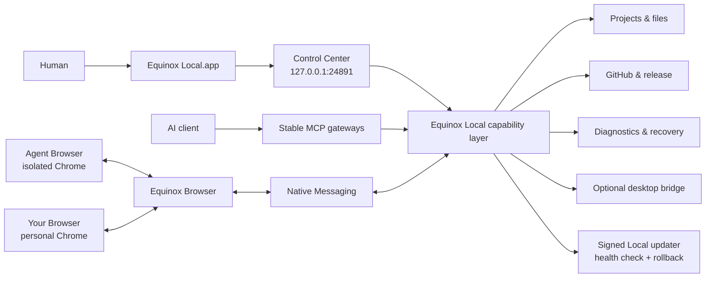

<div align="center">
  

# Equinox Local

**A local control plane for AI agents — powerful enough to do real work, bounded enough to stay understandable.**

**Built to let ChatGPT on the web safely work with your own Mac — through explicit, inspectable local capabilities instead of an unrestricted remote shell.**

[](https://github.com/sametbasbug/equinox-local/actions/workflows/ci.yml)


[](LICENSE)

[Product site](https://local.sametbasbug.dev/) · [Security](SECURITY.md) · [Architecture](docs/architecture.md) · [Contributing](CONTRIBUTING.md)
</div>

> **Current production:** Equinox Local `5.1.0` on the signed stable channel and Equinox Browser `0.7.0` on the permanent Unlisted Chrome Web Store item. Every Local release must pass public-source CI/CodeQL, native architecture validation, managed smoke, signing verification, lifecycle upgrade validation and live-channel checks before promotion.

## What is Equinox Local?

Equinox Local runs on your Mac and gives an AI client a deliberately bounded way to work with local projects, GitHub, browser automation, release workflows, diagnostics, and optional desktop control. A native macOS **Equinox Local** app opens Control Center for the human while the management backend remains private on loopback, without requiring source edits or a pile of terminal commands.

The goal is not to turn your computer into an unrestricted remote shell. The goal is to expose useful, inspectable capabilities with explicit roots, fixed operations, guarded mutations, and clear user controls.

### The short version

| Surface | Boundary |
| --- | --- |
| Local execution & files | Terminal-first logged-in-user execution; structured file primitives keep protected-path/symlink guards, with restricted root scope available under Advanced |
| Git | Project-scoped operations with branch/SHA/worktree guards |
| Equinox Browser | One extension/Native Messaging engine with isolated-default Agent Browser and explicit Your Browser; per-profile consent/on-off control |
| Control Center | Native macOS app backed by the loopback-only UI/API on `127.0.0.1:24891` |
| Task continuity | Durable bounded Task Capsules plus explicitly armed, fail-closed Auto Continue |
| Updates | Ed25519-signed metadata, bounded downloads, verified activation, automatic rollback |
| Desktop | Optional Peekaboo 4.5+ bridge with foreground-capable native desktop automation |
| Telegram | Optional but recommended private-user pairing, task-aware remote inbox, bounded inline controls, and private file/photo exchange |
| Agent API | Stable MCP gateways backed by a dynamic capability registry |

## Why build another local agent runtime?

Agent tooling often optimizes for either **maximum capability** or **maximum safety through limitation**. Equinox Local tries to make the boundary itself a product surface:

- **Agent-friendly:** terminal-first local execution, root-aware project discovery, release automation, runtime diagnostics, browser primitives, and credential/deployment integrations.
- **Human-friendly:** a real English/Türkçe Control Center for health, projects, durable Tasks, agent safety, Browser/Desktop access, updates, and uninstall, plus a compact native macOS menu-bar surface for Active/Paused state, Emergency Stop/Resume, Agent Browser launch, runtime health and restart. The native menu, companion quick actions, and restrained Nyx speech bubbles follow the same English/Türkçe UI choice as Control Center; task lifecycle messages are automatic while casual/time-aware lines appear only when the human clicks Nyx. Closing Control Center keeps the menu-bar controller alive and removes the Dock icon until the window is reopened; **Quit Equinox Local** is distinct from Emergency Stop and fully stops the trusted per-user Local LaunchAgent/runtime until the app is opened again.
- **Local-first:** project data and runtime state live on the user's machine unless a requested action needs a connected AI/service provider.
- **No arbitrary HTTP command console:** Control Center uses bounded management endpoints rather than a generic shell backend.
- **One browser transport, two explicit contexts:** Equinox Browser powers isolated-default Agent Browser and explicit Your Browser through the same extension/Native Messaging path; there is no hidden QA-browser or CDP fallback.
- **Failure-aware:** health checks, repair recipes, recovery policies, update rollback, and bounded runtime observability are built in rather than bolted on later.

## Architecture



See [docs/architecture.md](docs/architecture.md) for the longer version.

## Equinox Browser

Equinox Browser is the required Chrome companion and the **only product browser transport**. Fresh managed setup does not unlock the normal Control Center until **Your Browser** has the extension connected, the browser-data disclosure is accepted and Browser Control is enabled. The same extension also serves the isolated-default **Agent Browser** context; the two contexts keep independent profile/consent state and never silently fall back to each other. Install the unlisted production extension from [Chrome Web Store](https://chromewebstore.google.com/detail/equinox-browser/npdneefcobilfkjlihghjgjnknenhfoj). Control Center links directly to that Store listing during Setup and from the Browser page after setup. Chrome Web Store remains the owner of extension distribution and updates.

The extension intentionally has no broad `host_permissions`. Normal browser automation uses Chrome's documented debugger interface and a local Native Messaging bridge, while a narrowly scoped `https://chatgpt.com/*` content script observes only bounded continuity state (`generationActive`, user/assistant turn identifiers and composer ready/empty booleans) for Turn Budget and Auto Continue. That passive observer does not read message text and does not attach the debugger, so Chrome's debugging infobar appears only for real browser-control or continuation-delivery mutations. Turning browser control off rejects browser-automation commands while allowing the bounded settings channel to remain available. Bookmark automation is intentionally Agent Browser-only; Your Browser bookmark requests fail closed. The popup also owns the profile-local Auto Continue target preference: automatic mode binds the one generating ChatGPT task, while an explicit human pin binds one exact open ChatGPT conversation and never falls back if that pin closes or navigates away.

More: [docs/browser.md](docs/browser.md)

## Task Capsules, Auto Continue and Fresh Chat Resume

Task Capsules are small durable checkpoint records, not transcript archives. Each active task keeps bounded human-readable state such as its objective, completed work, next steps, safe references and a monotonically increasing checkpoint revision. The store keeps at most 50 capsules by default; when more space is needed, only the oldest completed/cancelled records are pruned and active work is never evicted. Control Center's **Tasks** workspace lists recent capsules and lets the human inspect or revision-guard edit active work, cancel a pending continuation, complete/cancel the task, or permanently delete a completed/cancelled capsule after confirmation. Active capsules cannot be deleted directly. When a fresh-chat transition fails safely, the same workspace becomes a small recovery console with human-readable state/reason and only state-safe actions.

Auto Continue is deliberately one-shot. An agent must explicitly arm every automatic next turn, and a chain is bounded to three automatic hops before a fresh chain must be started. Local binds the arm to the exact generating ChatGPT conversation (or a human-pinned popup target), waits for generation to finish and the composer to stay safely empty, persists the delivery reservation before crossing the browser-mutation boundary, and never blindly retries an ambiguous send. An armed continuation can survive a Local runtime restart because the Task Capsule is durable. One-shot Auto Continue/Fresh Chat Resume mutations release debugger attachments on a short 250 ms lease when they acquired the attachment themselves; the normal 60-second browser-automation lease is preserved when an attachment was already active.

Turn Budget protects the end of long ChatGPT Web turns without introducing another hard stop. It is enabled by default with a 22-minute safety cutoff measured from the first Equinox Local use in that assistant turn. When Equinox Browser can identify the active generation, Local uses the current user epoch as the primary turn identity and the assistant-turn key as fallback; otherwise it uses a conservative first-Local-call fallback. Passive status reads retire a finished browser turn back to Idle, while a new turn starts its budget only on that turn's first Equinox Local call. Tool results progressively tell the agent to stop starting major work, save a safe Task Capsule checkpoint, arm Auto Continue when more work remains, and send a normal final response before the platform timeout. Long Local blocking waits are shortened inside the finalization window so control returns to the agent. Control Center → **Safety** shows live elapsed/remaining/stage state and lets the human enable/disable the feature or change the cutoff immediately without restarting Local. Turn Budget never arms Auto Continue or terminates a turn by itself.

Fresh Chat Resume explicitly hands an active Task Capsule to one new ChatGPT conversation without copying the transcript. It preserves root/project scope, reserves durable state plus an extension receipt before browser mutation, creates/submits at most one destination and binds the task only after the new conversation identity is confirmed. A prepared handoff can survive a Local restart. If mutation becomes ambiguous, Equinox does **not** retry it automatically; Control Center can clear the blocked transition so work can continue from the saved checkpoint without replaying the uncertain browser action.

The human always wins: typing into the composer, submitting a new message, changing/closing the bound conversation, cancelling from Tasks, or pressing **Emergency Stop** retires the pending continuation before another automatic turn is allowed. A stale explicit pin fails closed instead of silently choosing another ChatGPT tab or Chrome profile.

## Equinox Local 5.0 — Continuum

Version 5.0 is the Continuum release: durable Task Capsules, guarded Auto Continue/Fresh Chat Resume, native ChatGPT ↔ Mac file transfer, unified native Quit behavior, and a deliberately smaller seven-tool agent-facing MCP surface. ChatGPT Web → Mac imports now default to `~/Downloads/Equinox Local/Web/` when no explicit destination is supplied; Control Center can change or reset that default without restart, while explicit destinations continue to win. Upgrading from 4.x is handled by the normal signed updater, but cached ChatGPT connector schemas may require one manual Refresh because the top-level MCP contract intentionally changed. See `docs/migrating-to-5.0.md` for the migration notes.

## Installation

Install the current stable Equinox Local release as your normal macOS user:

```bash
curl -fsSL https://local.sametbasbug.dev/downloads/updates/install-equinox-local.sh | /bin/bash
```

The public path is a small user-level macOS bootstrap that:

1. refuses `sudo`/root execution;
2. detects Apple Silicon vs Intel;
3. downloads only from the pinned Equinox Local HTTPS update path;
4. verifies exact release byte count and SHA-256 before extraction;
5. installs the self-contained managed runtime under the user's Library;
6. registers the per-user LaunchAgent and Equinox Browser Native Messaging host; and
7. installs the native `Equinox Local.app` shell and opens it for onboarding.

It does **not** require Git, Homebrew, a system Node installation, a separate Peekaboo installation, administrator authentication, or a paid Apple Developer membership. The managed release bundles its verified Peekaboo desktop runtime alongside the pinned Node and tunnel runtimes.

Current installation status is maintained at [local.sametbasbug.dev/install](https://local.sametbasbug.dev/install/).

Fresh managed installs treat **Local Execution** (Terminal/processes) as the core terminal-first local capability. It runs with the logged-in macOS user's normal permissions; configured projects/folders and structured file scope do not sandbox a running shell. **Equinox Browser is a required product component during first-time setup**, while Desktop automation remains optional. Advanced restricted mode keeps the legacy structured-root scope and Terminal-disable controls for specialized containment, with clear warnings that disabling Local Execution heavily restricts the product. Equinox-managed provider credentials are not injected into generic Terminal/process environments. `terminal_exec` uses a bounded foreground `wait_ms`; if that wait expires, the same command keeps running under the managed-process lifecycle and returns a `processId`/cursor for `process_wait`, `process_logs` or `process_stop` continuation instead of being killed or restarted. `process_wait` can efficiently wait for finite managed work without polling and never kills the process when its wait expires. Exposed MCP calls are replay-guarded, so transport/orchestration redelivery reuses the original invocation/result rather than re-running side effects; a separate intentional identical request still executes normally. Control Center's **Emergency Stop** immediately pauses new mutating agent actions and stops Local-managed Terminal/process work while preserving read-only status/MCP connectivity; **Resume** re-enables future mutations without restarting stopped work.

The dynamic Files gateway is intentionally minimal: project/root discovery plus the bounded `image_view` visual primitive. **For a PNG/JPEG/WebP that already exists on the Mac, `image_view` is the preferred first choice when the task is visual inspection.** It reads the local path directly as real MCP image content; agents should not use `file_export` or create a ChatGPT/container copy merely to inspect an image. `file_export` is for intentional transfer into the conversation. `image_view` follows Agent Access root/protected-path rules, rejects symlinks and oversized/absurd images, and is not a generic file reader. Ordinary file editing, searching, copying, local Git, GitHub PR/Actions, package-manager, build and test work uses Terminal instead of wrapper operations; `gh` uses the user’s system-keyring login while generic execution receives no injected Equinox-managed provider token. Deployment, release, Browser, Desktop and runtime capabilities remain explicit special operations.
`files_call` preserves raw multimodal MCP content, so `image_view` can deliver the image itself rather than metadata-only text through the stable gateway.

### Connect Equinox Local to ChatGPT

Equinox Local runs on your Mac, while ChatGPT connects to remote MCP endpoints. To bridge the two without exposing a local port to the public internet, Equinox Local uses OpenAI Secure MCP Tunnel.

You need **two separate values** from OpenAI Platform:

1. **Tunnel ID** — open [Platform → Tunnels](https://platform.openai.com/settings/organization/tunnels), create a tunnel for the ChatGPT workspace that should use Equinox Local, then copy its `tunnel_…` identifier.
2. **Runtime API key** — open [Platform → API keys](https://platform.openai.com/settings/organization/api-keys), create a **Restricted** runtime key and grant only **Tunnels: Read + Use**. Do not use an admin key or Tunnels: Manage for the long-lived Local runtime.

After the managed Local install finishes, the app opens a dedicated **Setup** mode. Normal Control Center sections stay hidden until the end-to-end path has been proven; theme/language controls and uninstall remain available. Setup walks the human through these steps:

1. Create the OpenAI tunnel and a **Restricted** Runtime API key with only **Tunnels: Read + Use**, then paste both values into Equinox Local. The key is stored only in a private `0600` file on this Mac.
2. In ChatGPT, create or edit the Equinox Local MCP app/connector, choose **Connection: Tunnel**, and select or paste the **same Tunnel ID** shown by Setup.
3. Install **Equinox Browser** from Chrome Web Store in the personal Chrome profile used with ChatGPT, accept the browser-data disclosure and enable **Browser Control**. Setup detects this automatically.
4. Send the provided safe verification prompt from ChatGPT. Setup remains locked until a real Equinox Local MCP tool call reaches the Mac.

When the private tunnel is connected, Your Browser is connected/consented/enabled and the first real agent tool call has arrived, Local persists a `completedAt` first-run milestone and unlocks the normal Control Center. That milestone is durable: a later tunnel outage or disabled extension becomes a normal **Needs attention** condition and does not send an established user back into first-time Setup. Managed installations upgraded from releases that predate this milestone file are treated as already set up rather than being unexpectedly locked.

Control Center keeps operational state live automatically while the window is visible. Runtime/task/activity/onboarding state refreshes every 3 seconds, Doctor and integration state every 15 seconds, and cached config/update state every 60 seconds. Returning focus triggers an immediate bounded refresh, background polling pauses while hidden, overlapping refreshes are suppressed, and active task/config/browser/HTTP-profile/Turn Budget edits are preserved. Passive polling, including the native menu-bar status heartbeat, is excluded from the human-facing Control Center request counter, richer integration state is preserved across faster partial status snapshots, and Overview connection status is independent from first-run onboarding availability. The **Refresh** button remains available as an explicit full refresh and error surface.

The tunnel client makes an outbound HTTPS connection to OpenAI; Equinox Local does not need an inbound firewall rule or a public MCP port. If the tunnel does not appear in ChatGPT, verify that it was created for the correct workspace and that the relevant principal has **Tunnels Read + Use**. Newly created tunnels may also take a short time to become available.

See [docs/tunnel.md](docs/tunnel.md) for the full setup and troubleshooting path. ChatGPT plan/workspace support for custom MCP apps and write/modify actions is controlled by OpenAI and may change independently of Equinox Local.

### Recommended optional Telegram pairing

Telegram is optional, but fresh Setup marks it **Recommended** because it is the remote human-contact channel for Equinox Local. The setup screen teaches the complete flow: open **BotFather**, send `/newbot`, choose the bot name/username, copy the HTTP API token, paste that token into Equinox Local, choose **Pair Telegram**, then open the new bot and send `/start`. Equinox Local discovers only a private-user candidate and shows a masked/labelled account for explicit human confirmation. No Telegram user ID needs to be found or typed manually. **Skip for now** never blocks first-time Setup; the same pairing flow remains available later under Control Center → **Services**.

The token, confirmed private recipient, transient pairing state and bounded inbound queue are stored only on the Mac in Equinox Local's private `secrets` directory with `0600` file permissions. Pairing expires after a bounded window, old Telegram updates are skipped before pairing begins, and the next-update offset is persisted so a Local restart does not replay consumed updates. Group/supergroup/channel messages and updates from any account other than the confirmed private user are ignored. Control Center and MCP results expose only readiness, a masked user hint and bounded pairing metadata—never the token or full Telegram ID.

Agents use the Services & integrations gateway through `telegram_send_message` and `telegram_send_file`; neither operation can choose or override the recipient. `telegram_send_file` accepts only a local path that passes the same Full/Selected file-export policy used by the native file bridge, so protected credential/application-data paths, symlinks and out-of-root Selected-mode files remain blocked. Local exposes **no generic Telegram inbox/read tool to agents**. Instead, the confirmed private human gets a bounded task-aware remote inbox and remote-control surface. `/status` returns compact Local/Browser/task state, `/tasks` presents every active Task Capsule as an interactive control hub with Continue / Mark complete / Cancel; verified ChatGPT conversations additionally expose Use for chat / Unbind / Open in ChatGPT, and `/help` shows the available Telegram commands. These commands are registered only for the paired private chat in Telegram's native command menu and are best-effort resynced after pairing/configuration and runtime startup. Control Center → **Services → Telegram** also exposes a default-on **Telegram remote control** switch. OFF leaves outbound notifications/file delivery available while inbound updates are polled, acknowledged and discarded without executing them, preventing delayed replay after re-enable. During a browser-bound active assistant turn Local refreshes Telegram's short-lived `typing` action from the existing Turn Budget activity signal. Recognized commands are handled before task-reply routing, so a slash command cannot accidentally become Task Capsule human input.

A Task Capsule that changes after Telegram activation receives one durable Telegram task card, later checkpoints/status changes edit that same card, and active cards provide **Continue**, **Mark complete**, **Cancel task**, and—when a verified private ChatGPT binding exists—**Open in ChatGPT**. Replying to the exact mapped task card stores one bounded pending human instruction directly on that Task Capsule and attempts the existing guarded Auto Continue route for the exact bound conversation. If the browser target is unavailable, the instruction remains durable rather than being dropped.

`/status` is also the remote-control entry point. Its short-lived inline controls expose **Emergency Stop** while the agent is running, **Resume** while paused, and **Restart**. Emergency Stop and Restart require a second, action-specific confirmation within a short expiry window; stale or mismatched confirmation callbacks fail closed. These controls call the same Agent Control and runtime restart services used by Control Center rather than parallel Telegram-specific implementations.

Telegram Chat Bridge builds on that paired-private-user surface without exposing a generic inbox. Chat routing is **Task-only**: a Task Capsule with a verified ChatGPT conversation can be selected from its controls, while `/tasks` acts as the interactive Task control hub rather than a chat-only picker. `/chat` reports the current Task binding as a card with **↗ Open in ChatGPT** and **🔌 Unbind** controls; the Current Task chat card shown after `/tasks` selection exposes the same controls. `/unbind` remains the command equivalent. Completed/cancelled Tasks cannot remain or become Telegram chat targets: an already-pending final bridge response may settle first, then Local auto-unbinds; terminal cards keep **Open in ChatGPT** only. If no Task chat is selected, a normal Telegram message does not open or guess a ChatGPT destination; Local asks the human to use `/tasks`.

The `/tasks` picker also offers **➕ New task**. Selecting it makes the next Telegram text message the Task description, creates a durable Task Capsule, opens exactly one new root ChatGPT conversation for that Task, binds the conversation to the new Task, and forwards its first final assistant response back to Telegram. This is the only Telegram path that creates a new ChatGPT conversation.

Task-bound bridge text is intentionally small: the user message plus `task_id`, and—when one Telegram photo/document was downloaded for that turn—`local_file` with the exact local path. The bridge does not send attachment ids, MIME, byte size, hashes, resolver instructions, or tool-selection prose to the agent. Browser-side attachment re-upload remains absent. The agent decides from the Task request whether the local path needs visual inspection, document reading, local move/copy, or no file access.

Delivery still uses the dedicated text-free Chat Bridge lane with its own at-most-once receipts, exact Browser instance/tab/conversation checks, guarded `Input.insertText`, real send-button pointer submission, debugger-backed user-epoch confirmation, unique exact-conversation stale-tab reacquire, and bounded ambiguity stages. Final-response forwarding remains restart-safe: Local persists one pending bridge turn, reads only the final assistant response for that exact user epoch, writes `sending` before Telegram output, and never auto-replays an uncertain Browser or Telegram mutation.

A reply to an exact mapped task card may include one Telegram photo or document. Local records only bounded metadata in the private update queue, downloads the payload only for a mapped task reply through Telegram Bot API `getFile`, and stores it under the visible Telegram download folder (default `~/Downloads/Equinox Local/Telegram/`) with a bounded size, SHA-256 and opaque attachment id. Control Center can change the download folder without restart; only future files use the new folder and a bounded history of prior roots keeps existing Task Capsule attachments valid. User-visible Telegram downloads are never auto-deleted by default, including on Telegram disconnect. Public Task Capsule output omits the storage path. Agents can open only the attachment currently referenced by an exact task's pending `humanInput` using `telegram_attachment_open`; there is no attachment-list operation. Images additionally return real MCP image content when within the visual safety budget.

Telegram task actions are restart-safe. Local persists the update offset, task-message mapping and a bounded action journal before mutations. A mutation left `processing` by a runtime restart becomes **ambiguous** and is acknowledged without automatic replay; a repeated Telegram update ID is deduplicated. Callback data is a short internal route token and is accepted only when both that route and the originating Telegram message ID match the durable task mapping. The task's full ChatGPT conversation metadata remains private; public Task Capsule views expose only bounded status/human-input metadata. Outbound delivery remains plain text and long free-form messages are split into Telegram-safe chunks.

### Authenticated HTTP Profiles

Control Center → **Services** also provides **Authenticated HTTP Profiles** for third-party HTTPS APIs. A profile fixes an exact HTTPS origin and API base path, the allowed HTTP methods/path prefixes, optional agent-supplied headers and a bounded timeout. V1 supports Bearer tokens and validated secret-header authentication.

The credential is pasted only into Control Center and is stored in Equinox Local's private local secrets area. It is write-only from the browser's perspective and never appears in agent schemas or results. Agents can prepare profile structure through `integrations_call`, but Local attaches the credential only after validating the configured origin, request path, method, query, headers, body and timeout. Redirects are refused, and the exact credential is redacted from model-visible response/error material.

The **Allow agents to manage HTTP profiles** switch is on by default so an agent can create, edit or delete profile structure; turning it off blocks those structural mutations immediately while existing ready profiles remain usable. Changing the configured origin or authentication identity clears the existing credential and returns the profile to **Needs credential**.

For multi-step APIs, a valid non-truncated JSON response also receives a short-lived `response_id`. Preferred chaining uses body-external `response_bindings`: each binding names a source RFC 6901 pointer in that response and a missing target JSON object property in the new body; Local injects the opaque string only immediately before fetch. The older inline `$equinox_response_ref` form remains supported for compatibility. The handle is runtime-memory-only (10-minute TTL, 64 entries, 16 MiB total), RFC 6901 pointers are bounded, cross-profile/trust reuse fails closed, and resolved values are transiently redacted from downstream response/error material. Text, invalid JSON and truncated responses are never referenceable.

## Updates

After first install, Local manages its own update lifecycle. Stable release manifests are signed with an offline/external Ed25519 key whose public half is pinned into the runtime. Before activation Local verifies the download, stages a versioned release, performs a controlled restart, checks the expected version/health, and restores the previous release if activation fails.

Equinox Browser updates remain owned by Chrome Web Store; the Local updater never overwrites or sideloads the extension.

More: [docs/updates.md](docs/updates.md)

## Repository layout

```text
.
├── src/               # Equinox Local runtime and Control Center source
├── extension/         # Equinox Browser Chrome extension
├── tests/             # Unit, browser, fixture, helper, and release tests
├── scripts/           # Local tooling, installer, Browser packaging, release tooling
├── examples/          # Generic configuration examples
├── docs/              # Architecture and security documentation
├── assets/            # Repository artwork
└── .github/           # CI and contribution templates
```

Tests live under `tests/` on purpose: they remain part of the public trust story without turning the repository root into a wall of `*.test.js` files.

## Development

### Requirements

- macOS
- Node.js **26.10.0 or newer**
- npm
- Git

```bash
npm ci
npm run check
npm run test:fast   # quick local iteration
npm test            # full release/lifecycle coverage
```

The fast profile covers recursive unit/browser behavior and is intended for normal development loops; the full suite additionally exercises release/install/update/native-lifecycle paths. The public test suite covers browser consent/lifecycle, Auto Continue target/delivery guards, Task Capsule persistence, Agent Access and credential boundaries, project discovery, bounded local-image viewing, terminal execution, Control Center request boundaries, managed install/update/rollback/uninstall, source-runtime synchronization, internal release workflows, repair/recovery, Native Messaging, and runtime observability. The CI badge above is the durable source for the current test status.

Peekaboo desktop automation uses the pinned 4.5+ MCP runtime with explicit foreground authority. The Desktop gateway exposes the native desktop subset needed for effective automation, including coordinate input, shared-pointer move/drag, foreground scrolling and keyboard input, app/window/menu/Dock/Space lifecycle, dialogs, direct paste, clipboard mutation, capture, and `verify_state`. Peekaboo's separate `agent`, `analyze`, `image`, and `browser` stacks remain outside the gateway because Equinox already provides those responsibilities. Runtime pinning, `--no-remote`, credential-clean subprocesses, permission preflight, live schema compatibility checks, and bounded I/O remain enforced.

Source-checkout runtime configuration is intentionally external. Start with [examples/equinox-local-config.example.json](examples/equinox-local-config.example.json) and keep real machine paths/credentials out of the repository. The source restart path synchronizes both the development tunnel client and pinned Peekaboo runtime from the same version/SHA/signing policy used by managed release packaging; System Doctor reports version drift without exposing configured executable paths.

## Security model

Security-sensitive design choices are documented rather than hidden behind implementation detail. Highlights include:

- loopback-only Control Center;
- strict Host/origin/CSRF handling for management mutations;
- user-controlled Full/selected filesystem modes with path containment and protected credential/application-secret areas;
- symlink defenses and expected-SHA guards where mutations need them;
- mutation scopes/locks around competing operations;
- minimal credential-free environments for detached helpers;
- no browser automation before explicit Equinox Browser consent;
- no unattended Auto Continue after human composing/input, Emergency Stop, target drift or a stale explicit pin;
- bounded logs/artifacts and redaction before observability persistence;
- signed managed updates with health-verified rollback.

Read [SECURITY.md](SECURITY.md) and [docs/security-model.md](docs/security-model.md) before changing a security boundary.

## Contributing

Issues and focused pull requests are welcome. Please read [CONTRIBUTING.md](CONTRIBUTING.md) first. Changes that weaken a boundary for convenience — for example adding an arbitrary Control Center command endpoint or a fallback into user Chrome — will not be accepted.

## License

Equinox Local is licensed under the **GNU Affero General Public License v3.0 only** (`AGPL-3.0-only`). See [LICENSE](LICENSE).

Copyright © 2026 Samet Başbuğ.
