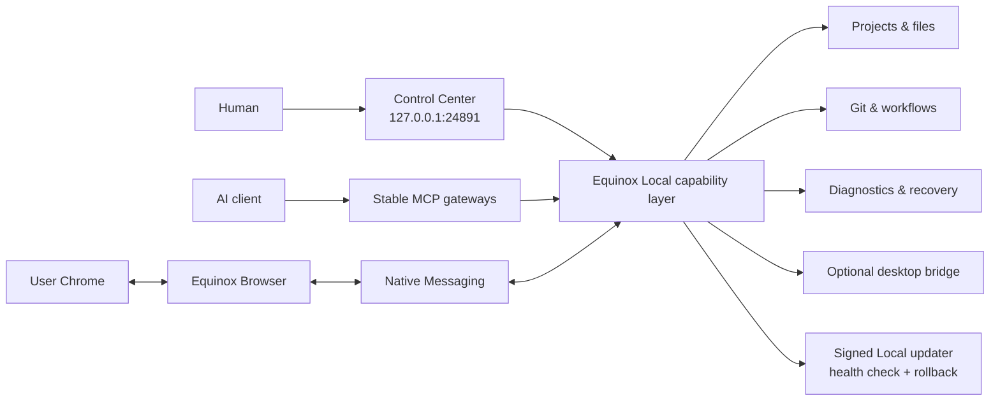

<div align="center">
  

# Equinox Local

**A local control plane for AI agents — powerful enough to do real work, bounded enough to stay understandable.**

[](https://github.com/sametbasbug/equinox-local/actions/workflows/ci.yml)


[](LICENSE)

[Product site](https://local.sametbasbug.dev/) · [Security](SECURITY.md) · [Architecture](docs/architecture.md) · [Contributing](CONTRIBUTING.md)
</div>

> **Release-candidate status:** the clean public source, native Apple Silicon and Intel managed-release paths, clean-macOS install/reboot/uninstall lifecycle, and encrypted production-signing-key backup have all passed their pre-release gates. The public bootstrap and Equinox Browser remain intentionally unpublished pending explicit release authorization.

## What is Equinox Local?

Equinox Local runs on your Mac and gives an AI client a deliberately bounded way to work with local projects, Git, browser automation, workflows, diagnostics, and optional desktop control. A localhost **Control Center** exposes the same boundaries to a human without requiring source edits or a pile of terminal commands.

The goal is not to turn your computer into an unrestricted remote shell. The goal is to expose useful, inspectable capabilities with explicit roots, fixed operations, guarded mutations, and clear user controls.

### The short version

| Surface | Boundary |
| --- | --- |
| Projects & files | Explicit configured roots, path containment, symlink checks, bounded reads/writes |
| Git | Project-scoped operations with branch/SHA/worktree guards |
| Equinox Browser | The only product route into user Chrome; Native Messaging + visible consent/on-off control |
| Control Center | Loopback-only management UI on `127.0.0.1:24891` |
| Updates | Ed25519-signed metadata, bounded downloads, verified activation, automatic rollback |
| Desktop | Optional Peekaboo bridge with a deliberately reduced allowlist |
| Agent API | Stable MCP gateways backed by a dynamic capability registry |

## Why build another local agent runtime?

Agent tooling often optimizes for either **maximum capability** or **maximum safety through limitation**. Equinox Local tries to make the boundary itself a product surface:

- **Agent-friendly:** structured capabilities, persistent workflows, runtime diagnostics, Git and browser primitives.
- **Human-friendly:** a real Control Center for health, projects, permissions, browser state, updates, and uninstall.
- **Local-first:** project data and runtime state live on the user's machine unless a requested action needs a connected AI/service provider.
- **No arbitrary HTTP command console:** Control Center uses bounded management endpoints rather than a generic shell backend.
- **One user-Chrome route:** Equinox Browser is the only product browser-automation lane. Internal release/QA browsers are not exported as product capabilities.
- **Failure-aware:** health checks, repair recipes, recovery policies, update rollback, and bounded runtime observability are built in rather than bolted on later.

## Architecture



See [docs/architecture.md](docs/architecture.md) for the longer version.

## Equinox Browser

Equinox Browser is the companion Chrome extension and the **only product path that controls the user's Chrome profile**. A fresh install starts with browser automation disabled. The user must accept the browser-data disclosure and explicitly enable control.

The extension intentionally has no broad `host_permissions`; browser actions are performed through Chrome's documented debugger interface and a local Native Messaging bridge. Turning browser control off rejects browser-automation commands while allowing the bounded settings channel to remain available.

More: [docs/browser.md](docs/browser.md)

## Installation

The public installer is intentionally **not live yet**. Pre-release technical gates are green; publication remains disabled until explicit release authorization and the coordinated repo/artifact/site/Chrome Web Store release sequence.

The planned public path is a small user-level macOS bootstrap that:

1. refuses `sudo`/root execution;
2. detects Apple Silicon vs Intel;
3. downloads only from the pinned Equinox Local HTTPS update path;
4. verifies exact release byte count and SHA-256 before extraction;
5. installs the self-contained managed runtime under the user's Library;
6. registers the per-user LaunchAgent and Equinox Browser Native Messaging host; and
7. opens Control Center for onboarding.

It does **not** require Git, Homebrew, a system Node installation, administrator authentication, or a paid Apple Developer membership.

Current installation status is maintained at [local.sametbasbug.dev/install](https://local.sametbasbug.dev/install/).

### Connect Equinox Local to ChatGPT

Equinox Local runs on your Mac, while ChatGPT connects to remote MCP endpoints. To bridge the two without exposing a local port to the public internet, Equinox Local uses OpenAI Secure MCP Tunnel.

You need **two separate values** from OpenAI Platform:

1. **Tunnel ID** — open [Platform → Tunnels](https://platform.openai.com/settings/organization/tunnels), create a tunnel for the ChatGPT workspace that should use Equinox Local, then copy its `tunnel_…` identifier.
2. **Runtime API key** — open [Platform → API keys](https://platform.openai.com/settings/organization/api-keys), create a **Restricted** runtime key and grant only **Tunnels: Read + Use**. Do not use an admin key or Tunnels: Manage for the long-lived Local runtime.

After the managed Local install finishes:

1. Open Control Center at `http://127.0.0.1:24891/`.
2. In **Connect to ChatGPT**, paste the Tunnel ID and Runtime API key.
3. Choose **Save & connect**. Equinox Local stores the key only in a private `0600` file on this Mac and schedules a safe restart into tunnel mode.
4. In ChatGPT, enable the custom-app/developer-mode flow available to your plan/workspace, create or edit the MCP app/connector, choose **Connection: Tunnel**, and select or paste the **same Tunnel ID**.
5. Scan/refresh the app tools after the tunnel is connected.

The tunnel client makes an outbound HTTPS connection to OpenAI; Equinox Local does not need an inbound firewall rule or a public MCP port. If the tunnel does not appear in ChatGPT, verify that it was created for the correct workspace and that the relevant principal has **Tunnels Read + Use**. Newly created tunnels may also take a short time to become available.

See [docs/tunnel.md](docs/tunnel.md) for the full setup and troubleshooting path. ChatGPT plan/workspace support for custom MCP apps and write/modify actions is controlled by OpenAI and may change independently of Equinox Local.

## Updates

After first install, Local manages its own update lifecycle. Stable release manifests are signed with an offline/external Ed25519 key whose public half is pinned into the runtime. Before activation Local verifies the download, stages a versioned release, performs a controlled restart, checks the expected version/health, and restores the previous release if activation fails.

Equinox Browser updates remain owned by Chrome Web Store; the Local updater never overwrites or sideloads the extension.

More: [docs/updates.md](docs/updates.md)

## Repository layout

```text
.
├── src/               # Equinox Local runtime and Control Center source
├── extension/         # Equinox Browser Chrome extension
├── tests/             # Unit, browser, fixture, helper, and release tests
├── scripts/           # Local tooling, installer, Browser packaging, release tooling
├── examples/          # Generic configuration examples
├── docs/              # Architecture and security documentation
├── assets/            # Repository artwork
└── .github/           # CI and contribution templates
```

Tests live under `tests/` on purpose: they remain part of the public trust story without turning the repository root into a wall of `*.test.js` files.

## Development

### Requirements

- macOS
- Node.js **24.19.0 or newer**
- npm
- Git

```bash
npm ci
npm run check
npm test
```

The public test suite currently contains **245 passing tests** covering browser consent/lifecycle, path and symlink guards, Control Center request boundaries, managed install/update/rollback/uninstall, workflows, repair/recovery, Native Messaging, and runtime observability.

Source-checkout runtime configuration is intentionally external. Start with [examples/equinox-local-config.example.json](examples/equinox-local-config.example.json) and keep real machine paths/credentials out of the repository.

## Security model

Security-sensitive design choices are documented rather than hidden behind implementation detail. Highlights include:

- loopback-only Control Center;
- strict Host/origin/CSRF handling for management mutations;
- explicit filesystem roots and path containment;
- symlink defenses and expected-SHA guards where mutations need them;
- mutation scopes/locks around competing operations;
- minimal credential-free environments for detached helpers;
- no browser automation before explicit Equinox Browser consent;
- bounded logs/artifacts and redaction before observability persistence;
- signed managed updates with health-verified rollback.

Read [SECURITY.md](SECURITY.md) and [docs/security-model.md](docs/security-model.md) before changing a security boundary.

## Contributing

Issues and focused pull requests are welcome. Please read [CONTRIBUTING.md](CONTRIBUTING.md) first. Changes that weaken a boundary for convenience — for example adding an arbitrary Control Center command endpoint or a fallback into user Chrome — will not be accepted.

## License

Equinox Local is licensed under the **GNU Affero General Public License v3.0 only** (`AGPL-3.0-only`). See [LICENSE](LICENSE).

Copyright © 2026 Samet Başbuğ.
