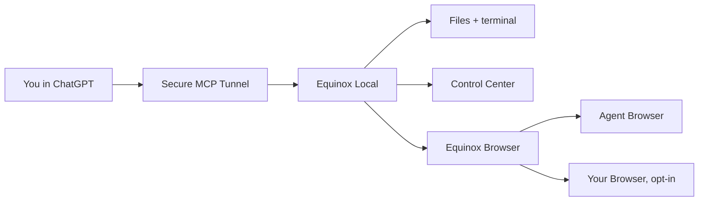

<div align="center">
  

  # Equinox Local

  **Your AI assistant. Your computer. Your control.**

  A local-first bridge that lets ChatGPT work with your files, terminal, browser and desktop — with a native Control Center and explicit user permissions.

  [](https://github.com/sametbasbug/equinox-local/releases/latest)
  [](https://github.com/sametbasbug/equinox-local/actions/workflows/ci.yml)
  [](LICENSE)
  

  **[Get started](https://local.sametbasbug.dev/install/)** · **[Features](#what-you-can-do)** · **[How it works](#how-it-works)** · **[Documentation](#documentation)** · **[Contribute](CONTRIBUTING.md)**
</div>

---

## What you can do

ChatGPT runs in the cloud; your projects and apps often don't. Equinox Local connects them through an **outbound OpenAI Secure MCP Tunnel**, keeping Control Center private on your computer. It works with a companion Chrome extension, [**Equinox Browser**](https://chromewebstore.google.com/detail/equinox-browser/npdneefcobilfkjlihghjgjnknenhfoj), for browser interactions.

<table>
<tr><td width="50%">

**🗂️ Projects & terminal**

Search and edit local projects, run commands and tests, and manage bounded processes using your normal user permissions.

</td><td width="50%">

**🌐 Browser automation**

Work in an isolated Agent Browser or, when explicitly selected, Your Browser. Both use the same Chrome extension and consent controls.

</td></tr>
<tr><td>

**🔁 Tasks that survive interruptions**

Task Capsules, Auto Continue and Fresh Chat Resume preserve the next steps of long-running work without replaying uncertain actions.

</td><td>

**💬 Telegram, when you want it**

Open a new ChatGPT task, continue a bound conversation, receive answers and manage tasks from your private bot chat.

</td></tr>
<tr><td>

**🖥️ Native Control Center**

See health, review activity, adjust agent access, manage tasks and check updates. Desktop automation is optional.

</td><td>

**🛡️ Verified updates**

Signed Stable releases, opt-in admitted Main snapshots, health checks and rollback. Browser extension updates stay with Chrome Web Store.

</td></tr>
</table>

> [!IMPORTANT]
> **Local-first is not a sandbox.** Enabling Terminal lets an agent run commands with your signed-in operating-system account's permissions, including outside selected project folders. Review agent access, use Emergency Stop when needed, and read the [security model](docs/security-model.md).

## Install Equinox Local

<details open>
<summary><strong>macOS · Apple silicon & Intel</strong></summary>

Run as your normal user (not with `sudo`):

```bash
curl -fsSL https://local.sametbasbug.dev/downloads/updates/install-equinox-local.sh | /bin/bash
```

The installer validates its signed release payload and sets up the native app and per-user runtime. No separate Node, Homebrew, Git or Peekaboo installation is required.

</details>

<details open>
<summary><strong>Windows · ARM64 & x64</strong></summary>

Download the [official PowerShell installer](https://local.sametbasbug.dev/downloads/updates/install-equinox-local.ps1) and review/run it in PowerShell, or follow the [Windows installation guide](https://local.sametbasbug.dev/install/). The installer provisions the verified release and required tools; a separate Node or Git installation is not needed.

</details>

**After installation:** Open Equinox Local's **Setup**, create an OpenAI Secure MCP Tunnel and a restricted runtime key, connect the same tunnel in ChatGPT, then install and enable Equinox Browser in Chrome. Setup walks you through each step and verifies the connection before unlocking Control Center.

**Requirements:** a supported macOS or Windows ARM64/x64 device, Chrome, network access and a ChatGPT plan/workspace that supports the required custom MCP connection. Telegram is optional. See [connection instructions](docs/tunnel.md) and [Browser setup](docs/browser.md).

## How it works


```mermaid
flowchart LR
    U[You in ChatGPT] --> T[Secure MCP Tunnel]
    T --> L[Equinox Local]
    L --> F[Files + terminal]
    L --> C[Control Center]
    L --> B[Equinox Browser]
    B --> A[Agent Browser]
    B --> Y[Your Browser, opt-in]
```

- **Human-controlled:** Control Center stays on loopback and exposes status, settings, agent access and Emergency Stop.
- **Browser-aware:** Your personal Chrome profile and the isolated Agent Browser keep separate state; the system never silently switches between them.
- **Resumable, not reckless:** guarded browser delivery avoids automatically repeating a message when its send outcome is uncertain.
- **Two release channels:** Stable is the default; Main is opt-in and advances only after the four-platform snapshot passes CI. Updating Local never sideloads the Chrome extension.

Read the [architecture](docs/architecture.md), [Browser](docs/browser.md), [updates](docs/updates.md) and [security](docs/security-model.md) guides for the implementation details.

## Documentation

| Guide | What you'll find |
| --- | --- |
| [Install & connect](https://local.sametbasbug.dev/install/) · [Tunnel setup](docs/tunnel.md) | Supported systems, onboarding and ChatGPT connection |
| [Equinox Browser](docs/browser.md) | Agent Browser vs Your Browser, permissions, controls |
| [Telegram & tasks](docs/telegram.md) | Private bot pairing, new tasks, chat continuation, commands |
| [Architecture](docs/architecture.md) | How the runtime, UI, MCP gateways and native platforms fit together |
| [Security model](docs/security-model.md) · [Security reports](SECURITY.md) | Permissions, trust boundaries, responsible disclosure |
| [Updates & rollback](docs/updates.md) | Stable vs Main, signatures and recovery |
| [Contributing](CONTRIBUTING.md) · [Changelog](CHANGELOG.md) | Local development, tests, release history |
| [Migrating to 5.0](docs/migrating-to-5.0.md) | Historic major-version transition notes |

## For developers

This is the **canonical public source** for Equinox Local, Equinox Browser, native macOS/Windows shells, installers and tests. The optional private factory tooling is **not** another product fork; production and factory environments consume verified canonical source while keeping local configuration and credentials outside Git.

```bash
git clone https://github.com/sametbasbug/equinox-local.git
cd equinox-local
npm ci
npm run check
npm run test:fast
```

See [CONTRIBUTING.md](CONTRIBUTING.md) for the supported Node version, full test suite, Windows prerequisites and PR guidance. Please use the [issue templates](https://github.com/sametbasbug/equinox-local/issues/new/choose) for problems or improvements, and [private vulnerability reporting](SECURITY.md) for security issues.

## Releases & license

**Equinox Local 6.0.1** is the current Stable release, paired with **Equinox Browser 1.0.0** on Chrome Web Store. Stable packages cover macOS and Windows on ARM64 and x64. [Latest release](https://github.com/sametbasbug/equinox-local/releases/latest) · [Product website](https://local.sametbasbug.dev/) · [Release notes](CHANGELOG.md).

Licensed under **[AGPL-3.0-only](LICENSE)**. Contributions are welcome; see [CONTRIBUTING.md](CONTRIBUTING.md) and [CODE_OF_CONDUCT.md](CODE_OF_CONDUCT.md).
