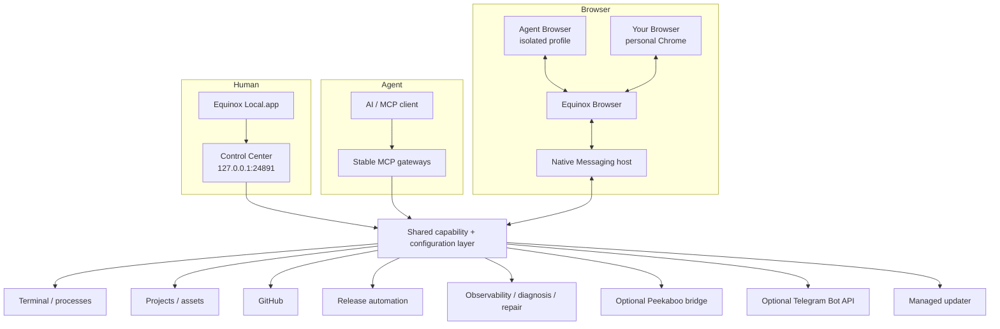

# Architecture

Equinox Local is a per-user macOS control plane that exposes bounded local capabilities to AI clients while giving the human a native macOS Control Center backed by a private loopback management service.

## Main surfaces

The human UI and agent surface intentionally converge on the same configuration and operation layer rather than implementing separate privileged backends.

## Configuration

Machine-specific project roots live outside the repository in the user's Equinox Local configuration. The loaded registry defines:

- projects and their filesystem-root shortcuts;
- read-only extra file roots;
- Agent Access (`files: full|selected`, Terminal/process, Desktop and Browser switches);
- the default project;
- the managed workspace project;
- the downloads root; and
- Control Center enablement/port.

Fresh managed configs explicitly seed Full Agent Access. Existing configs that predate `agentAccess` normalize to selected-root filesystem behavior so an update does not silently widen prior boundaries. The configuration parser rejects unknown fields, unsafe IDs, duplicate configured roots, filesystem-root configuration, non-boolean capability switches and unsupported writable extra roots.

## Stable MCP surface

The top-level MCP API stays intentionally small: one read-only `capabilities` discovery tool plus semantic call gateways for runtime, files, browser, desktop, release/deployment and integrations. The Files domain publishes an explicit routing hint: for Mac-local PNG/JPEG/WebP visual inspection, prefer `image_view` directly and do not use `file_export`/container-copy as an inspection workaround. `capabilities` lists domains, supports bounded keyword search, and returns exact live operation schemas on demand. Operation schemas are validated at invocation time, while the underlying operation handler retains its original project context, mutation locks, path guards, and error semantics.
The Files gateway is registered as a raw MCP gateway so multimodal/resource content survives end-to-end; other stable semantic gateways keep the text-normalized contract.

This keeps the public connector surface at seven tools while allowing the runtime to gain new operations without turning every operation into a permanently cached top-level MCP schema. Browser operations use short agent-facing aliases (`snapshot`, `click`, `wait`, etc.); desktop status/refresh/restart are explicit `desktop_call` operations rather than hidden discovery flags.

## Terminal, project discovery, and GitHub

Root-aware structured capabilities resolve through the active Agent Access file mode. Selected mode uses configured roots; Full mode can use configured IDs, `home`, or an accessible absolute folder as the active contained root. Direct filesystem-root access and protected credential/application-secret areas are blocked for ad-hoc Full roots, and traversal/symlink escape is rejected in both modes. The retained Files gateway is limited to project/root discovery. Terminal/process is the terminal-first path for ordinary local file/repo/Git/GitHub/package-manager work and intentionally follows the logged-in macOS user's shell permissions; once a shell starts it is not confined to Selected roots. Generic execution environments are sanitized so Equinox-managed provider credentials are not inherited; GitHub PR/Actions work may use the user’s separately authenticated system-keyring `gh` CLI without token injection. `terminal_exec` starts each noninteractive zsh command once under the managed-process lifecycle: it waits for a bounded foreground response window, preserves stdout/stderr plus observed combined ordering, and returns the same process ID/cursor when work continues instead of killing or restarting it. Explicit long-lived non-PTY servers/watchers may start directly with `process_*`. PTY sessions keep their interactive shell semantics while Local tracks the controlling TTY's owned jobs so explicit stop/shutdown can drain jobs that zsh placed into separate process groups.

Ordinary local Git/worktree/GitHub commands run through Terminal and follow repository policy rather than a dedicated Git wrapper surface. `gh` may use the user's system-keyring authentication, while Equinox-managed provider credentials remain outside generic Terminal. The Control Center management API exposes no arbitrary Git or shell endpoint.

## Equinox Browser

Equinox Browser is the only product browser transport. It serves two explicit Chrome contexts behind the same extension, Native Messaging host and local bridge: **Agent Browser** is the default isolated Equinox Local profile (`target=agent`), while **Your Browser** is the user's personal Chrome profile and must be selected explicitly (`target=user`). The two contexts keep independent Chrome/profile state and Equinox Local never silently falls back from one to the other.

Browser-control consent and the on/off state live independently in each extension profile. Equinox Local cannot silently enable control before the current disclosure has been accepted. Agent Browser bookmark automation is intentionally isolated to `target=agent`; Your Browser bookmark calls fail closed before the bridge and in the extension. The extension popup also owns a profile-local Auto Continue target choice; explicit pins are human-selected and a stale pin never falls back to another tab/profile.

The retired loopback/CDP QA browser is not part of the product architecture. Release and visual QA use the same first-party Agent Browser extension/Native Messaging lane rather than a second isolated browser backend.

## Task continuity

Equinox Local stores bounded durable **Task Capsules** under its managed workspace rather than duplicating ChatGPT transcripts. A capsule contains the current task objective, completed and next steps, safe references, status, checkpoint revision and bounded continuation metadata. The store defaults to a 50-capsule retention ceiling: capacity pressure prunes only the oldest terminal (`completed`/`cancelled`) records, while active work is never evicted. Checkpoint replacement is atomic and revision guarded so stale human edits cannot overwrite a newer agent checkpoint.

**Auto Continue** is an explicitly armed one-shot transition, not an autonomous loop. Each hop binds immutable Browser context/instance/tab/conversation/user-epoch/assistant-turn identity, has a TTL, and requires a new explicit arm after delivery; automatic chains are capped at three hops. Armed state can be reconciled after a Local runtime restart, while a persisted in-flight delivery is treated as ambiguous and never blindly retried. Human composing/new input, explicit cancellation, target drift and Emergency Stop retire pending arms.

**Fresh Chat Resume** moves the same durable Task Capsule to one fresh ChatGPT conversation without storing or copying the transcript. Root/project identity is verified before rebinding, Local persists `prepared`/`creating`/`confirmed`/`ambiguous` transition state, and the Browser extension claims a bounded receipt before creating the destination. Only a pre-mutation `prepared` transition is resumable after restart; in-flight uncertainty is fail-closed and never automatically retried. Control Center exposes fixed cancel/abandon recovery actions for prepared/ambiguous transitions, with no generic retry endpoint.

## Control Center

The normal human entry point is the native `Equinox Local.app`, a small AppKit + WKWebView shell that renders Control Center from `127.0.0.1:24891`. The loopback URL remains usable for development and diagnostics, while the app keeps the browser address bar out of the product experience. Control Center itself is served by the runtime with fixed routes and same-origin assets; it is not a general static-file server. The Tasks workspace uses bounded list/detail routes for Task Capsules and fixed update/complete/cancel/delete/continuation-cancel plus Fresh Chat Resume cancel/abandon actions. Permanent delete is terminal-only: active capsules must first be completed or cancelled. Ambiguous recovery only clears the blocked transition; it never retries browser mutation. Mutations use validated JSON, same-origin checks, CSRF protection, and expected-revision guards where configuration/task changes are involved.

Optional service integrations keep credentials outside the public configuration surface. Telegram uses explicit private-user pairing instead of requiring a manually typed Telegram ID: Control Center validates the BotFather token, begins a bounded pairing session, discovers only a private `/start` candidate and requires the human to confirm that account before the credential is persisted. Group/channel candidates and all updates from unpaired users are rejected. Pairing state, credentials, the bounded inbound queue and task-message routing journal are private `0600` local state; persisted next-update/action records prevent replay across Local restarts.

The agent surface has bounded `telegram_send_message` and `telegram_send_file` operations—there is no generic agent-facing Telegram inbox/read operation. File sending keeps the paired recipient fixed and reuses the normal Local file-export access policy. The paired human also gets a bounded Telegram Remote Control surface: `/status`, `/tasks`, `/chat`, `/unbind` and `/help` are registered only for that private chat. A default-on Control Center switch can disable this inbound remote-control surface without disabling outbound Telegram delivery; while disabled, updates are consumed and discarded rather than queued for later execution. Browser-bound active assistant turns refresh Telegram's short-lived `typing` action through the same inbox cycle. Bound chat cards expose **↗ Open in ChatGPT** plus **🔌 Unbind**; the callback is exact-message scoped and shares the same cleanup path as `/unbind`. `/status` creates short-lived exact-message controls for Emergency Stop/Resume and runtime Restart. Emergency Stop and Restart use action-specific expiring confirmations and the same shared Agent Control/restart services as Control Center.

Telegram Chat Bridge is Task-scoped. A Task must still be active at bind time and before every new bridged mutation; completed/cancelled Tasks auto-unbind after any pending final response settles and cannot be rebound, though their Open in ChatGPT link remains available.  `/tasks` opens controls for every active Task Capsule; verified Task conversations can then be explicitly selected for chat while preserving `task_id`; a normal unbound Telegram message never guesses or creates a ChatGPT target and instead asks the human to select a Task. `/tasks` also exposes an explicit **New task** action: the next Telegram text becomes the Task objective, Local creates the Task Capsule, opens one root ChatGPT conversation, confirms it, and binds that exact conversation to the new Task. No implicit target search, project picker, or cross-profile fallback is allowed.

One Telegram photo/document may be downloaded once into the configured user-visible Telegram folder. Chat Bridge does not create an opaque resolver protocol around that file: Task-bound turns send only user text + `task_id` + optional exact `local_file`; there is no taskless Chat Bridge mode. The agent chooses whether the path needs visual inspection, document reading, local move/copy, or no file access at all. Browser-side re-upload is absent. Task-card replies remain a separate Task Capsule `humanInput` path with opaque attachment metadata and exact-task `telegram_attachment_open`.

Chat Bridge v9 keeps a separate delivery-receipt namespace and debugger-backed state lane. Bound-chat delivery uses guarded `Input.insertText`, waits for a real enabled send button, performs trusted pointer submission, and confirms a new user epoch. Fresh chats use generic Browser create/snapshot/type/URL-confirm primitives, then allow `previousAssistantTurnKey=null` only for reading the first final assistant response. Local persists one pending bridge turn, writes `sending` before Telegram output, and converts restart/send/browser uncertainty to terminal ambiguity rather than replaying.

A dedicated internal Telegram task inbox controller maps one bot message to one Task Capsule, edits the same card as the task changes and accepts only callbacks whose short route token **and** originating Telegram message ID match that mapping. Active cards include a bounded next-step hint; terminal updates edit the same card, remove mutation controls and show the finished timestamp rather than emitting another lifecycle message. Replies to a mapped card become one bounded `humanInput` record on the Task Capsule. Normal task checkpoints clear the consumed pending input. Task checkpoints also best-effort capture a private exact ChatGPT conversation binding; Telegram Continue/reply routing can then reuse Auto Continue's exact-tab/conversation/turn delivery guards even when that conversation is idle. If a Telegram action is interrupted after durable reservation, restart marks it ambiguous and never automatically replays the mutation. A mapped task reply can include one photo/document: metadata stays bounded in the update journal, payload download uses Telegram `getFile` only after exact task-message mapping, and files are stored in a configurable user-visible download folder that defaults to `~/Downloads/Equinox Local/Telegram/`. Download-location settings keep a bounded history of prior roots so changing the destination affects only future files without breaking existing Task Capsule attachments; user-visible downloads are not auto-deleted. Public task state exposes an opaque attachment id rather than the storage path. `telegram_attachment_open` requires that opaque id plus the exact task and can only open the current pending human-input attachment.

## Managed installation

A managed install is per-user and versioned. A `current` pointer selects the active release. The LaunchAgent runs through the stable `Equinox Local.app` identity in explicit runtime-host mode, while the app can also launch a separate foreground Control Center window. The Browser Native Messaging host follows the managed current pointer rather than a developer checkout.

Native app-shell artifacts are versioned with the managed release and synchronized before runtime activation; activation rollback restores the app shell that belongs to the previous release. The first-install bootstrap and updater share the same release validation/activation concepts so the product has one managed lifecycle instead of separate installation and update worlds.

## Observability and recovery

Runtime events are bounded, rotated, and sanitized before persistence. Diagnosis converts correlated evidence into explicit incidents. Repair recipes and automatic recovery policies are fixed operations with ownership/health guards; they are not arbitrary commands generated from model output.

## What is intentionally not part of the public product

- private Equinox deployment profiles;
- maintainer-specific project integration wiring;
- retired legacy QA Chrome backends or alternate browser transports;
- generic shell/command management endpoints;
- a fallback into user Chrome outside Equinox Browser.
