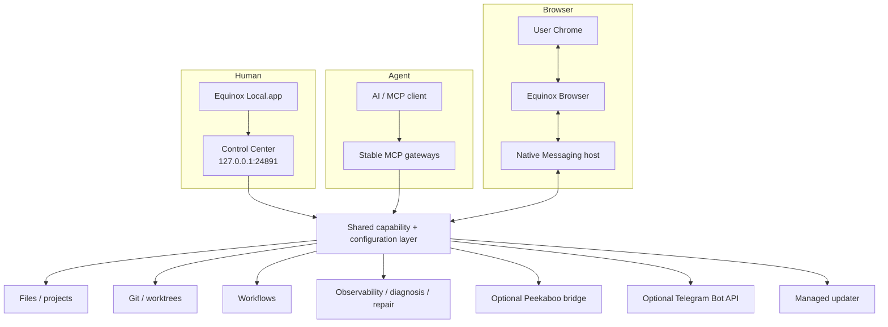

# Architecture

Equinox Local is a per-user macOS control plane that exposes bounded local capabilities to AI clients while giving the human a native macOS Control Center backed by a private loopback management service.

## Main surfaces

The human UI and agent surface intentionally converge on the same configuration and operation layer rather than implementing separate privileged backends.

## Configuration

Machine-specific project roots live outside the repository in the user's Equinox Local configuration. The loaded registry defines:

- projects and their filesystem-root shortcuts;
- read-only extra file roots;
- Agent Access (`files: full|selected`, Terminal/process, Desktop and Browser switches);
- the default project;
- the managed workspace project;
- the downloads root; and
- Control Center enablement/port.

Fresh managed configs explicitly seed Full Agent Access. Existing configs that predate `agentAccess` normalize to selected-root filesystem behavior so an update does not silently widen prior boundaries. The configuration parser rejects unknown fields, unsafe IDs, duplicate configured roots, filesystem-root configuration, non-boolean capability switches and unsupported writable extra roots.

## Stable MCP surface

The top-level MCP API stays intentionally small. Each domain exposes discovery plus invocation through a capability registry. Operation schemas are validated at invocation time, while the underlying operation handler retains its original project context, mutation locks, path guards, and error semantics.

This lets the runtime gain new operations without turning every operation into a permanently cached top-level MCP schema.

## Files and Git

Filesystem operations resolve through the active Agent Access mode. Selected mode uses configured roots; Full mode can use configured IDs, `home`, or an accessible absolute folder as the active contained root. Direct filesystem-root access and protected credential/application-secret areas are blocked for ad-hoc Full roots, and traversal/symlink escape is rejected in both modes. Core structured file CRUD works on ordinary non-Git Full-access roots without requiring a Terminal fallback; when the active root is a Git repository, ignore and dirty-worktree checks remain additive protections. Mutations use bounded payloads and expected SHA/revision checks where appropriate; `write_file` supports atomic UTF-8 create/replace and requires the current SHA-256 before replacing an existing file.

Git operations are project-scoped and encode explicit rules around clean worktrees, protected branches, HEAD SHA verification, worktree ownership, and remote synchronization. The product does not expose a generic Git command endpoint through the management API.

## Equinox Browser

Equinox Browser is the only product route into the user's Chrome profile. The Chrome extension connects to a local Native Messaging host, which connects to the Equinox Local browser bridge over a short private Unix socket path.

Browser-control consent and the on/off state live in the extension. Equinox Local cannot silently enable control before the current disclosure has been accepted.

Internal browser profiles used for development/release QA are not part of this public architecture and are deliberately excluded from the public source/capability projection.

## Control Center

The normal human entry point is the native `Equinox Local.app`, a small AppKit + WKWebView shell that renders Control Center from `127.0.0.1:24891`. The loopback URL remains usable for development and diagnostics, while the app keeps the browser address bar out of the product experience. Control Center itself is served by the runtime with fixed routes and same-origin assets; it is not a general static-file server. Mutations use validated JSON, same-origin checks, CSRF protection, and expected-revision guards where configuration changes are involved.

Optional service integrations keep credentials outside the public configuration surface. For Telegram, Control Center can connect, test, or disconnect a bot for exactly one positive Telegram user ID; group/channel IDs are rejected, status exposes only readiness and a masked user-ID hint, and the agent surface receives only the bounded `telegram_send_message` operation with message text. There is no Telegram inbox/read operation, so inbound messages from other Telegram users are not exposed to agents.

## Managed installation

A managed install is per-user and versioned. A `current` pointer selects the active release. The LaunchAgent runs through the stable `Equinox Local.app` identity in explicit runtime-host mode, while the app can also launch a separate foreground Control Center window. The Browser Native Messaging host follows the managed current pointer rather than a developer checkout.

Native app-shell artifacts are versioned with the managed release and synchronized before runtime activation; activation rollback restores the app shell that belongs to the previous release. The first-install bootstrap and updater share the same release validation/activation concepts so the product has one managed lifecycle instead of separate installation and update worlds.

## Observability and recovery

Runtime events are bounded, rotated, and sanitized before persistence. Diagnosis converts correlated evidence into explicit incidents. Repair recipes and automatic recovery policies are fixed operations with ownership/health guards; they are not arbitrary commands generated from model output.

## What is intentionally not part of the public product

- private Equinox deployment profiles;
- Orbit credentials/integration wiring used by the maintainer's private environment;
- internal QA Chrome profiles;
- generic shell/command management endpoints;
- a fallback into user Chrome outside Equinox Browser.
