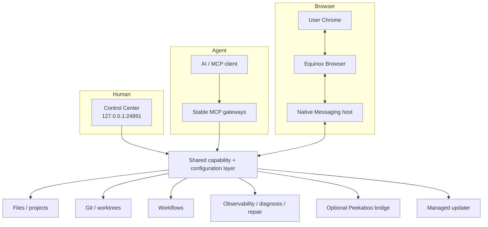

# Architecture

Equinox Local is a per-user macOS control plane that exposes bounded local capabilities to AI clients while giving the human a separate localhost management surface.

## Main surfaces

The human UI and agent surface intentionally converge on the same configuration and operation layer rather than implementing separate privileged backends.

## Configuration

Machine-specific project roots live outside the repository in the user's Equinox Local configuration. The loaded registry defines:

- projects and their filesystem roots;
- read-only extra file roots;
- the default project;
- the managed workspace project;
- the downloads root; and
- Control Center enablement/port.

The configuration parser rejects unknown fields, unsafe IDs, duplicate roots, filesystem-root access, and unsupported writable extra roots.

## Stable MCP surface

The top-level MCP API stays intentionally small. Each domain exposes discovery plus invocation through a capability registry. Operation schemas are validated at invocation time, while the underlying operation handler retains its original project context, mutation locks, path guards, and error semantics.

This lets the runtime gain new operations without turning every operation into a permanently cached top-level MCP schema.

## Files and Git

Filesystem operations resolve through configured roots and reject traversal/symlink escape. Mutations use bounded payloads and expected SHA/revision checks where appropriate.

Git operations are project-scoped and encode explicit rules around clean worktrees, protected branches, HEAD SHA verification, worktree ownership, and remote synchronization. The product does not expose a generic Git command endpoint through the management API.

## Equinox Browser

Equinox Browser is the only product route into the user's Chrome profile. The Chrome extension connects to a local Native Messaging host, which connects to the Equinox Local browser bridge over a short private Unix socket path.

Browser-control consent and the on/off state live in the extension. Equinox Local cannot silently enable control before the current disclosure has been accepted.

Internal browser profiles used for development/release QA are not part of this public architecture and are deliberately excluded from the public source/capability projection.

## Control Center

Control Center is served by the runtime on loopback. It uses fixed routes and same-origin assets; it is not a general static-file server. Mutations use validated JSON, same-origin checks, CSRF protection, and expected-revision guards where configuration changes are involved.

## Managed installation

A managed install is per-user and versioned. A `current` pointer selects the active release. The LaunchAgent and Browser Native Messaging host follow the managed current pointer rather than a developer checkout.

The first-install bootstrap and updater share the same release validation/activation concepts so the product has one managed lifecycle instead of separate installation and update worlds.

## Observability and recovery

Runtime events are bounded, rotated, and sanitized before persistence. Diagnosis converts correlated evidence into explicit incidents. Repair recipes and automatic recovery policies are fixed operations with ownership/health guards; they are not arbitrary commands generated from model output.

## What is intentionally not part of the public product

- private Equinox deployment profiles;
- Orbit credentials/integration wiring used by the maintainer's private environment;
- internal QA Chrome profiles;
- generic shell/command management endpoints;
- a fallback into user Chrome outside Equinox Browser.
