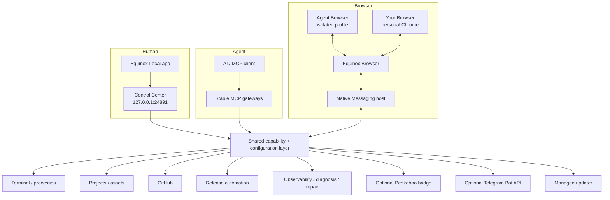

# Architecture

Equinox Local is a per-user **macOS and Windows** runtime that exposes local capabilities to AI clients while providing a native Control Center backed by a private loopback management service. Native shells and process supervision follow each platform’s lifecycle rules.

## Repository and installation ownership

`sametbasbug/equinox-local` is the single canonical product source: runtime, native/platform code, installers, public tests and product CI/CodeQL live here. Ordinary feature/fix and contributor PRs target canonical `main` without generating another source tree.

Private factory/ops orchestration is an external client of a clean canonical checkout and exact SHA. The public runtime's private-composition loader keeps a safe generic default; an explicitly configured, admitted external module may supply factory-only hooks without a public import back into private tooling. Private config, signing/provider/tunnel secrets and durable user state remain outside tracked source. Factory is an installation/profile role, not a second mutable product implementation.

Canonical repository ownership and Main lifecycle share one exact-SHA contract. Source checkouts retain a passive identity/discovery path that reports exact SHA and history distance without mutating Git state, while Main apply uses durable exact-SHA source storage, an atomic source pointer, managed restart/health verification, and rollback to the previously admitted source. Native admission is target-specific: canonical Main CI produces macOS ARM64/x64 and Windows ARM64/x64 snapshots, publishes immutable objects to the public Main distribution surface, and advances the tag-only `main-snapshot` pointer only after all four targets **and the complete product CI aggregate** succeed. Compatible updates use `reuse_native`; native-impact updates consume only the exact installed target snapshot. Trusted `managed-source` installations can apply admitted Main with **Update & restart**; developer source remains check-only and numbered Stable release activation/authorization remains independent. Documentation/metadata-only commits are repository history only: they use a lightweight Docs workflow, do not run the product/native matrix or CodeQL, and do not move `main-snapshot`, so they are not surfaced as runtime updates.

M8 enrollment machinery is admitted at Main snapshot `b73de11`; M9 keeps fresh installs Stable by default and requires explicit Main opt-in before using it. Stable release metadata binds the exact clean canonical source SHA that produced the verified artifact. After Stable health succeeds, a dedicated enrollment transaction provisions the pinned product-owned Dugite Native `v2.53.0-4` and Node `v26.11.1` toolchain, stages that exact SHA with only absolute product-owned Git/Node/npm paths, installs admitted prebuilt dependencies, validates the checkout, atomically promotes it to durable source storage, writes the source pointer, and writes the managed-source install stamp last. Failure before that final stamp leaves the numbered Stable installation healthy and authoritative. The same product-owned tool identities flow through managed Main inspection, staging, transactions, recovery and worker execution; ambient Git/npm/Node and local compiler toolchains are not ordinary-user dependencies.

## Main surfaces

```mermaid
flowchart TB
    subgraph Human
      APP[Equinox Local.app]
      CC[Control Center\n127.0.0.1:24891]
      APP --> CC
    end

    subgraph Agent
      CLIENT[AI / MCP client]
      GW[Stable MCP gateways]
    end

    CC --> CORE[Shared capability + configuration layer]
    CLIENT --> GW --> CORE

    CORE --> TERM[Terminal / processes]
    CORE --> FILES[Projects / assets]
    CORE --> GIT[GitHub]
    CORE --> WF[Release automation]
    CORE --> OBS[Observability / diagnosis / repair]
    CORE --> DESKTOP[Optional Peekaboo bridge]
    CORE --> TELEGRAM[Optional Telegram Bot API]

    subgraph Browser
      AGENT[Agent Browser\nisolated profile]
      USER[Your Browser\npersonal Chrome]
      EXT[Equinox Browser]
      HOST[Native Messaging host]
      AGENT <--> EXT
      USER <--> EXT
      EXT <--> HOST
    end

    HOST <--> CORE
    CORE --> UPDATER[Managed updater]
```

The human UI and agent surface intentionally converge on the same configuration and operation layer rather than implementing separate privileged backends.

## Configuration

Machine-specific project roots live outside the repository in the user's Equinox Local configuration. The loaded registry defines:

- projects and their filesystem-root shortcuts;
- read-only extra file roots;
- Agent Access (`files: full|selected`, Terminal/process, Desktop and Browser switches);
- the default project;
- the managed workspace project;
- the downloads root; and
- Control Center enablement/port.

Fresh managed configs explicitly seed Full Agent Access. Existing configs that predate `agentAccess` normalize to selected-root filesystem behavior so an update does not silently widen prior boundaries. The configuration parser rejects unknown fields, unsafe IDs, duplicate configured roots, filesystem-root configuration, non-boolean capability switches and unsupported writable extra roots.

## Stable MCP surface

The top-level MCP API stays intentionally small: one read-only `capabilities` discovery tool plus semantic call gateways for runtime, files, browser, desktop, release/deployment and integrations. The Files domain publishes an explicit routing hint: for Mac-local PNG/JPEG/WebP visual inspection, prefer `image_view` directly and do not use `file_export`/container-copy as an inspection workaround. `capabilities` lists domains, supports bounded keyword search, and returns exact live operation schemas on demand. Operation schemas are validated at invocation time, while the underlying operation handler retains its original project context, mutation locks, path guards, and error semantics.
The Files gateway is registered as a raw MCP gateway so multimodal/resource content survives end-to-end; other stable semantic gateways keep the text-normalized contract.

This keeps the public connector surface at seven tools while allowing the runtime to gain new operations without turning every operation into a permanently cached top-level MCP schema. Browser operations use short agent-facing aliases (`snapshot`, `click`, `wait`, etc.); desktop status/refresh/restart are explicit `desktop_call` operations rather than hidden discovery flags.

## Terminal, project discovery, and GitHub

Root-aware structured capabilities resolve through the active Agent Access file mode. Selected mode uses configured roots; Full mode can use configured IDs, `home`, or an accessible absolute folder as the active contained root. Direct filesystem-root access and protected credential/application-secret areas are blocked for ad-hoc Full roots, and traversal/symlink escape is rejected in both modes. The retained Files gateway is limited to project/root discovery. Terminal/process is the terminal-first path for ordinary local file/repo/Git/GitHub/package-manager work and intentionally follows the logged-in operating-system user's permissions; once a shell starts it is not confined to Selected roots. Generic execution environments are sanitized so Equinox-managed provider credentials are not inherited; GitHub PR/Actions work may use the user’s separately authenticated system-keyring `gh` CLI without token injection. `terminal_exec` starts each command once through the platform-selected finite shell (`/bin/zsh -lc` on macOS; noninteractive PowerShell on Windows) under the managed-process lifecycle: it waits for a bounded foreground response window, preserves stdout/stderr plus observed combined ordering, and returns the same process ID/cursor when work continues instead of killing or restarting it. Explicit long-lived non-PTY servers/watchers may start directly with `process_*`. Interactive sessions keep their platform shell semantics. On macOS, Local tracks the controlling TTY's owned jobs so explicit stop/shutdown can drain jobs that zsh placed into separate process groups; on Windows, the ConPTY session and descendants are owned by the accepted Job Object lifecycle instead.

Ordinary local Git/worktree/GitHub commands run through Terminal and follow repository policy rather than a dedicated Git wrapper surface. `gh` may use the user's system-keyring authentication, while Equinox-managed provider credentials remain outside generic Terminal. The Control Center management API exposes no arbitrary Git or shell endpoint.

## Equinox Browser

Equinox Browser is the only product browser transport. It serves two explicit Chrome contexts behind the same extension, Native Messaging host and local bridge: **Agent Browser** is the default isolated Equinox Local profile (`target=agent`), while **Your Browser** is the user's personal Chrome profile and must be selected explicitly (`target=user`). The two contexts keep independent Chrome/profile state and Equinox Local never silently falls back from one to the other.

Browser-control consent and the on/off state live independently in each extension profile. Equinox Local cannot silently enable control before the current disclosure has been accepted. Agent Browser bookmark automation is intentionally isolated to `target=agent`; Your Browser bookmark calls fail closed before the bridge and in the extension. The extension popup also owns a profile-local Auto Continue target choice; explicit pins are human-selected and a stale pin never falls back to another tab/profile.

The retired loopback/CDP QA browser is not part of the product architecture. Release and visual QA use the same first-party Agent Browser extension/Native Messaging lane rather than a second isolated browser backend.

## Task continuity

Equinox Local stores bounded durable **Task Capsules** under its managed workspace rather than duplicating ChatGPT transcripts. A capsule contains the current task objective, completed and next steps, safe references, status, checkpoint revision and bounded continuation metadata. The store defaults to a 50-capsule retention ceiling: capacity pressure prunes only the oldest terminal (`completed`/`cancelled`) records, while active work is never evicted. Checkpoint replacement is atomic and revision guarded so stale human edits cannot overwrite a newer agent checkpoint.

**Auto Continue** is an explicitly armed one-shot transition, not an autonomous loop. Each hop binds immutable Browser context/instance/tab/conversation/user-epoch/assistant-turn identity, has a TTL, and requires a new explicit arm after delivery; automatic chains default to 10 hops and expose a bounded 1–20 Control Center setting. Armed state can be reconciled after a Local runtime restart, while a persisted in-flight delivery is treated as ambiguous and never blindly retried. Human composing/new input, explicit cancellation, target drift and Emergency Stop retire pending arms.

**Fresh Chat Resume** moves the same durable Task Capsule to one fresh ChatGPT conversation without storing or copying the transcript. Root/project identity is verified before rebinding, Local persists `prepared`/`creating`/`confirmed`/`ambiguous` transition state, and the Browser extension claims a bounded receipt before creating the destination. Only a pre-mutation `prepared` transition is resumable after restart; in-flight uncertainty is fail-closed and never automatically retried. Control Center exposes fixed cancel/abandon recovery actions for prepared/ambiguous transitions, with no generic retry endpoint.

## Control Center

The normal human entry point is the platform-native Equinox Local shell rendering the same Control Center from `127.0.0.1:24891`: AppKit + WKWebView in `Equinox Local.app` on macOS, and WPF + WebView2 in `EquinoxLocal.exe` on Windows x64. Both shells remain thin lifecycle/presentation hosts over the shared loopback backend and keep a default-browser fallback rather than introducing a second management server. Turn Budget uses Browser turn identity when available; when it must fall back to Local activity, that fallback retires to Idle after a user-configurable inactivity timeout (default five minutes), and passive Control Center/status refreshes do not extend it. The loopback URL remains usable for development and diagnostics, while the app keeps the browser address bar out of the product experience. Control Center consolidates update status into the sidebar and a compact on-demand dialog rather than a permanent Overview card. Main source installations show `version - shortSHA`, Stable installations show only the numbered version. The running service checks its installed update channel after startup and approximately every six hours even if the Control Center window is closed; check failures remain unknown/attention states, never "up to date". Stable additionally reads the public, CI-admitted `main-snapshot` GitHub tag for an **informational** Main-availability hint, independently of the signed Stable manifest. This notice never authorizes Main activation or switches channels; Stable installation continues to require its signed release and the existing explicit user-initiated update flow. Control Center itself is served by the runtime with fixed routes and same-origin assets; it is not a general static-file server. The Tasks workspace uses bounded list/detail routes for Task Capsules and fixed update/complete/cancel/delete/continuation-cancel plus Fresh Chat Resume cancel/abandon actions. Permanent delete is terminal-only: active capsules must first be completed or cancelled. Ambiguous recovery only clears the blocked transition; it never retries browser mutation. Mutations use validated JSON, same-origin checks, CSRF protection, and expected-revision guards where configuration/task changes are involved.

Optional service integrations keep credentials outside the public configuration surface. Telegram uses explicit private-user pairing instead of requiring a manually typed Telegram ID: Control Center validates the BotFather token, begins a bounded pairing session, discovers only a private `/start` candidate and requires the human to confirm that account before the credential is persisted. Group/channel candidates and all updates from unpaired users are rejected. Pairing state, credentials, the bounded inbound queue and task-message routing journal are private local state protected by the platform private-state contract (`0600` files on macOS; current-user protected ACLs on Windows); persisted next-update/action records prevent replay across Local restarts. Network-derived pairing/inbox records are canonicalized through the same bounded schema before persistence and again after readback; malformed persisted entries fail closed rather than becoming trusted local state.

The agent surface has bounded `telegram_send_message` and `telegram_send_file` operations—there is no generic agent-facing Telegram inbox/read operation. File sending keeps the paired recipient fixed and reuses the normal Local file-export access policy. The paired human also gets a bounded Telegram Remote Control surface: `/status`, `/tasks`, `/chat`, `/unbind` and `/help` are registered only for that private chat. A default-on Control Center switch can disable this inbound remote-control surface without disabling outbound Telegram delivery; while disabled, updates are consumed and discarded rather than queued for later execution. Browser-bound active assistant turns refresh Telegram's short-lived `typing` action through the same inbox cycle. Bound chat cards expose **↗ Open in ChatGPT** plus **🔌 Unbind**; the callback is exact-message scoped and shares the same cleanup path as `/unbind`. `/status` creates short-lived exact-message controls for Emergency Stop/Resume and runtime Restart. Emergency Stop and Restart use action-specific expiring confirmations and the same shared Agent Control/restart services as Control Center.

Telegram Chat Bridge is Task-scoped. A Task must still be active at bind time and before every new bridged mutation; completed/cancelled Tasks auto-unbind after any pending final response settles and cannot be rebound, though their Open in ChatGPT link remains available.  `/tasks` opens controls for every active Task Capsule; verified Task conversations can then be explicitly selected for chat while preserving `task_id`; a normal unbound Telegram message never guesses or creates a ChatGPT target and instead asks the human to select a Task. `/tasks` also exposes an explicit **New task** action: the next Telegram text becomes the Task objective, Local creates the Task Capsule, opens one root ChatGPT conversation, confirms it, and binds that exact conversation to the new Task. No implicit target search, project picker, or cross-profile fallback is allowed.

One Telegram photo/document may be downloaded once into the configured user-visible Telegram folder. Chat Bridge does not create an opaque resolver protocol around that file: Task-bound turns send only user text + `task_id` + optional exact `local_file`; there is no taskless Chat Bridge mode. The agent chooses whether the path needs visual inspection, document reading, local move/copy, or no file access at all. Browser-side re-upload is absent. Task-card replies remain a separate Task Capsule `humanInput` path with opaque attachment metadata and exact-task `telegram_attachment_open`.

Chat Bridge v9 keeps a separate delivery-receipt namespace and debugger-backed state lane. Bound-chat delivery uses guarded `Input.insertText`, waits for a real enabled send button, performs trusted pointer submission, and confirms a new user epoch. Fresh chats use generic Browser create/snapshot/type/URL-confirm primitives, then allow `previousAssistantTurnKey=null` only for reading the first final assistant response. Local persists one pending bridge turn, writes `sending` before Telegram output, and converts restart/send/browser uncertainty to terminal ambiguity rather than replaying.

A dedicated internal Telegram task inbox controller maps one bot message to one Task Capsule, edits the same card as the task changes and accepts only callbacks whose short route token **and** originating Telegram message ID match that mapping. Active cards include a bounded next-step hint; terminal updates edit the same card, remove mutation controls and show the finished timestamp rather than emitting another lifecycle message. Replies to a mapped card become one bounded `humanInput` record on the Task Capsule. Normal task checkpoints clear the consumed pending input. Task checkpoints also best-effort capture a private exact ChatGPT conversation binding; Telegram Continue/reply routing can then reuse Auto Continue's exact-tab/conversation/turn delivery guards even when that conversation is idle. If a Telegram action is interrupted after durable reservation, restart marks it ambiguous and never automatically replays the mutation. A mapped task reply can include one photo/document: metadata stays bounded in the update journal, payload download uses Telegram `getFile` only after exact task-message mapping, and files are stored in a configurable user-visible download folder that defaults to `~/Downloads/Equinox Local/Telegram/`. Download-location settings keep a bounded history of prior roots so changing the destination affects only future files without breaking existing Task Capsule attachments; user-visible downloads are not auto-deleted. Public task state exposes an opaque attachment id rather than the storage path. `telegram_attachment_open` requires that opaque id plus the exact task and can only open the current pending human-input attachment.

## Managed installation

A managed install is per-user and versioned, with one platform-owned active-release pointer: macOS uses the managed `current` symlink, while Windows x64/ARM64 use the guarded `current-version.json` version file. macOS runs the managed runtime through the stable `Equinox Local.app` LaunchAgent identity; Windows x64/ARM64 use the stable WPF shell at the per-user Program root, which supervises the release-local runtime through the accepted Job Object lifecycle. The Browser Native Messaging registration follows the active managed release through the platform ownership contract instead of a developer checkout.

Native app-shell artifacts are versioned with the managed release and synchronized before runtime activation; activation rollback restores the app shell that belongs to the previous release. The first-install bootstrap and updater share the same release validation/activation concepts so the product has one managed lifecycle instead of separate installation and update worlds. Fresh-install activation gets a longer health budget than ordinary polling; if it still cannot become healthy, the verified release and active-release selection are preserved for a safe retry rather than deleting the backend underneath the installed native shell. Once Stable is healthy and its release metadata carries canonical `sourceSha`, the managed-source enrollment transaction may commit the exact source identity as described above. Lifecycle-specific recovery remains bounded: macOS reports/stops a failed LaunchAgent, while Windows preserves the owned stable-shell/current-version state for retry. On Windows 5.2.1+, shell runtime supervision uses the release-owned Node executable for a Job Object gate and waits for an explicit child-spawn acknowledgement before startup is considered released.

## Observability and recovery

Runtime events are bounded, rotated, and sanitized before persistence. Diagnosis converts correlated evidence into explicit incidents. Repair recipes and automatic recovery policies are fixed operations with ownership/health guards; they are not arbitrary commands generated from model output.

## Internal module boundaries

The composition root in `src/server.js` delegates tool registration to `equinox-local-tool-registration.js` and workspace directory preparation to `equinox-local-workspace-runtime.js`. Registration shares restart, pause and replay plumbing while retaining separate text/raw adapters: text operations keep project context, mutation scopes and text normalization; raw operations preserve multimodal content and do not acquire an implicit additional lock.

- `runtime-history-store.js` owns the repair/janitor JSONL read/retain/write mechanics; each caller retains its domain validation and query semantics.
- `equinox-control-center-localization.js` contains the language catalog and pure translators. The DOM entrypoint remains `equinox-control-center.js`; both are served through explicit same-origin asset routes, and release packaging traverses the UI import graph.
- `equinox-browser-artifacts.js` owns PDF snapshot enrichment and screenshot storage/integrity/quota helpers; tool routing and Browser-context guards remain in `equinox-browser-tools.js`.
- The classic extension worker loads `extension/bookmarks.js` with `importScripts`. The bookmark capability retains the Agent Browser-only boundary and existing rollback behavior; it is included in the explicit extension ZIP allowlist.
- `equinox-local-darwin-helper-environment.js` shares the minimal macOS detached-helper environment, while Windows keeps its platform-specific policy. `equinox-local-release-tree.js` shares bounded tree validation without combining first-install/update lifecycle orchestration.
- `scripts/lib/factory-tooling.mjs` shares source/test discovery and subprocess mechanics with explicit caller policy. `scripts/lib/package-io.mjs` shares streamed hashing. Extracted lifecycle-sensitive helpers retain the required production-upgrade-smoke classification.

These are internal boundaries, not new MCP operations, configuration keys or management endpoints. Native shells, process ownership and release/signing flows remain separate platform responsibilities.

## What is intentionally not part of the public product

- private Equinox deployment profiles;
- maintainer-specific project integration wiring;
- retired legacy QA Chrome backends or alternate browser transports;
- generic shell/command management endpoints;
- a fallback into user Chrome outside Equinox Browser.
